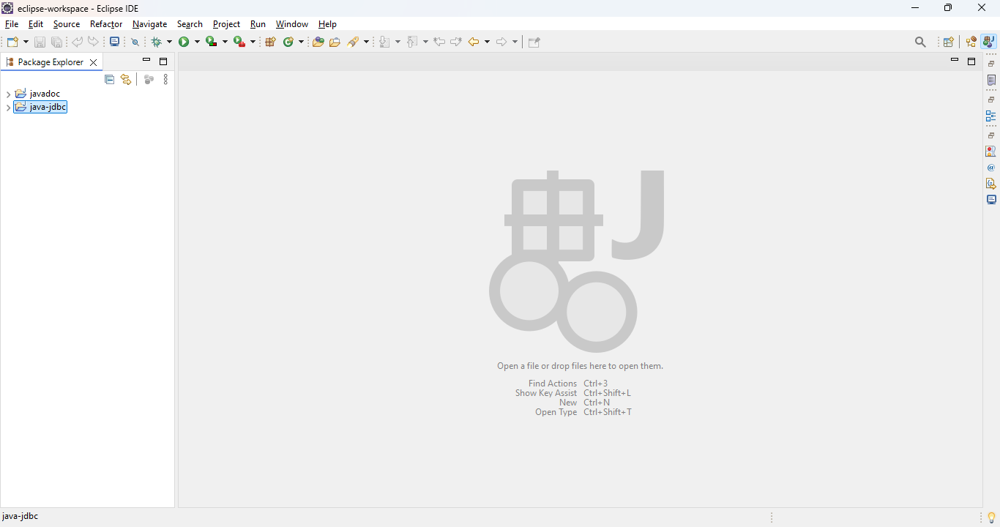
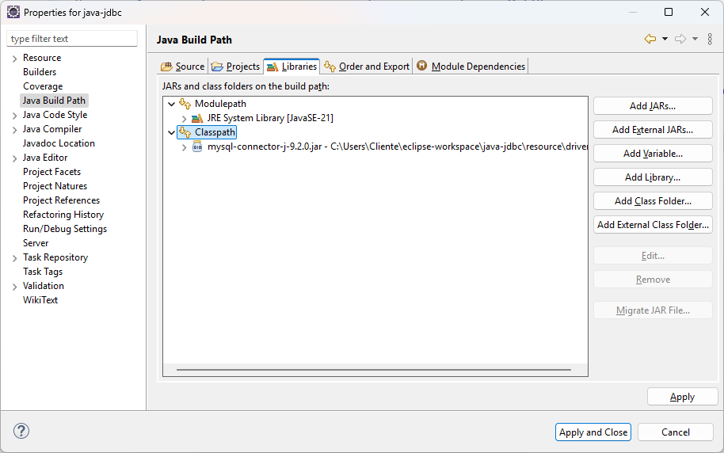

# JAVA COM JDBC

Essa aplicação consiste em cadastrar um usuário em um banco de dados MySQL.

## PRÉ-REQUSITOS
Para executar esse projeto você deve ter instalado na sua máquina as seguintes ferramentas:
- [JDK](https://www.oracle.com/br/java/technologies/downloads/): ambiente de desenvolvimento Java. 
- [MySQL](https://dev.mysql.com/downloads/installer/): opte pela instação da versão full.
- [Eclipse](https://www.eclipse.org/downloads/) ou uma IDE de sua preferência.

Além desses instaladores também será necessário o downlaod do driver de conexão com o banco de dados:
- [Driver JDBC MySQL](https://dev.mysql.com/downloads/file/?id=537130): biblioteca Java para conexão com o MySQL

## PROJETO

O projeto está divido em três pacotes:
- **entity**: camada que contém as classes que representam as entidades do banco de dados.
- **repository**: camada que realiza a interação com o banco de dados, realizando os comandos de inserção, atualização, consulta e remoção de registros.
- **service**: camada que implementa as regras de négocio da aplicação.

## REPOSITÓRIO

No repositório estão implementados os métodos que irão interagir com o banco de dados. Para que possamos enviar os comandos para o SGBD, precisamos antes de tudo estabelecer uma conexão com o SGBD. A conexão com o banco de dados é realizada por meio do método getConnection da classe DriverManager.

```
Conection connection = DriverManager.getConnection(CONNECTION_STRING, USUARIO, SENHA);
```
Esse método recebe três parâmetros:
- CONNECTION_STRING: string que contém os dados de conexão com o banco de dados
- USUARIO: nome do usuário de banco de dados
- SENHA: senha do usuário de banco de dados

A string de conexão permite que possamos nos conectar com qualquer banco de dados relacional e possui o seguinte formato:
```
jdbc:[sgbd]://[servidor]:[porta]/[meubanco]
```
Os termos que compõem a string de conexão são:
- **[sgbd]**: especifica qual é o SGBD da aplicação.
- **[servidor]**: ip do servidor com que queremos nos conectar.
- **[porta]**: porta na qual o serviço de banco de dados está rodando.
- **[meubanco]**: nome da base de dados do servidor de banco de dados com a qual queremos nos conectar.

A nossa string de conexão foi configurada da seguinte forma:
```java
private final String CONNECTION_STRING = "jdbc:mysql://localhost:3306/unifacear";
```
Isso significa que:
- A aplicação irá se conectar com um SGBD **MySQL**
- O servidor está rodando na máquina local **(localhost)**
- O serviço do SGBD está rodando na porta **3306**
- Os dados serão persistidos na base de dados chamada **unifacear**

## JDBC

JDBC (Java Database Connectivity) é uma API (Interface de Programação de Aplicações) no Java que permite que programas Java se conectem a bancos de dados relacionais (como MySQL, PostgreSQL, Oracle, etc.). Ele oferece uma maneira padrão e eficiente de interagir com bases de dados, permitindo que você execute consultas SQL, insira, atualize, exclua dados e manipule transações de maneira programática.

Para adicionar o driver JDBC ao projeto no Eclipse, clique sobre o projeto na aba "Package Explorer" e pressione as teclas ALT + Enter ou clique com o botão direito e selecione a opção "Properties".



Em seguida, na aba lateral, clique sobre o item "Java Build Path" e selecione a tab "Libraries". Clique sobre o item "Classpath", após selecionar esse item, clique no botão "Add External JARs". Na caixa de pesquisa adicione o driver JDBC.



Para finalizar clique no botão "Apply and Close".

## BIBLIOTECA JAVA.SQL

A biblioteca java.sql é um pacote fundamental no Java que contém as classes e interfaces necessárias para trabalhar com bancos de dados relacionais utilizando a API JDBC (Java Database Connectivity). Ela fornece as ferramentas para conectar, consultar, atualizar e manipular dados em um banco de dados SQL a partir de aplicações Java.

### Connection

A interface Connection é a principal interface utilizada para estabelecer e gerenciar a conexão com o banco de dados. Ela oferece métodos para:
- Criar e gerenciar transações: Como o controle de commit e rollback.
- Criar instruções (Statements): Como PreparedStatement e Statement que são usados para executar consultas SQL.
- Gerenciar o banco de dados: Como obter metadados e controlar o isolamento de transações.

### DriverManager

A classe DriverManager gerencia os drivers de banco de dados, que são usados para estabelecer uma conexão. Ela é responsável por selecionar o driver adequado para o banco de dados a partir dos drivers registrados e conectar-se a ele.

O método getConnection() é usado para obter uma instância da classe Connection que, por sua vez, estabelecerá a conexão com o banco de dados.


```java
import java.sql.Connection;
import java.sql.DriverManager;
import java.sql.SQLException;

public class Example {
    public static void main(String[] args) {
        try {
            // O DriverManager seleciona o driver adequado para a conexão
            Connection connection = DriverManager.getConnection("jdbc:mysql://localhost:3306/meubanco", "usuario", "senha");
            System.out.println("Conexão estabelecida com sucesso!");
        } catch (SQLException e) {
            e.printStackTrace();
        }
    }
}

```

### PreparedStatement
PreparedStatement é uma interface que estende Statement. Ela é usada para executar instruções SQL com parâmetros, o que melhora a segurança e performance. A principal vantagem é que ela evita a injeção de SQL, pois os valores dos parâmetros são tratados separadamente do comando SQL.

Além disso, ao usar PreparedStatement, o banco de dados pode otimizar a execução de consultas reutilizadas, uma vez que o SQL já está pré-compilado.

```java
import java.sql.Connection;
import java.sql.DriverManager;
import java.sql.PreparedStatement;
import java.sql.SQLException;

public class Exemplo {
    public static void main(String[] args) {
        try {
            Connection connection = DriverManager.getConnection("jdbc:mysql://localhost:3306/meubanco", "usuario", "senha");
            
            // SQL com parâmetros (?)
            String sql = "INSERT INTO pessoa (nome, idade) VALUES (?, ?)";
            
            // Criação do PreparedStatement e definição dos parâmetros
            PreparedStatement pstmt = connection.prepareStatement(sql);
            pstmt.setString(1, "João");
            pstmt.setInt(2, 30);
            
            // Executando a inserção
            pstmt.executeUpdate();
            System.out.println("Dados inseridos com sucesso!");
        } catch (SQLException e) {
            e.printStackTrace();
        }
    }
}
```

### ResultSet
A interface ResultSet é usada para armazenar e manipular os dados retornados por uma consulta SQL (SELECT). Quando você executa uma consulta com Statement ou PreparedStatement, o banco de dados retorna um conjunto de resultados que é representado pelo ResultSet.

O ResultSet permite percorrer as linhas dos resultados e acessar os dados de cada coluna.

- **next()**: Move o cursor para a próxima linha.
- **getString(), getInt(), getDate(), etc**: Usado para acessar os valores das colunas.

```java
import java.sql.Connection;
import java.sql.DriverManager;
import java.sql.PreparedStatement;
import java.sql.ResultSet;
import java.sql.SQLException;

public class Exemplo {
    public static void main(String[] args) {
        try {
            Connection connection = DriverManager.getConnection("jdbc:mysql://localhost:3306/meubanco", "usuario", "senha");
            
            String sql = "SELECT * FROM pessoa";
            PreparedStatement pstmt = connection.prepareStatement(sql);
            
            // Executando a consulta e obtendo os resultados
            ResultSet rs = pstmt.executeQuery();
            
            // Iterando sobre os resultados
            while (rs.next()) {
                int id = rs.getInt("id");
                String nome = rs.getString("nome");
                int idade = rs.getInt("idade");
                
                System.out.println("ID: " + id + ", Nome: " + nome + ", Idade: " + idade);
            }
        } catch (SQLException e) {
            e.printStackTrace();
        }
    }
}
```